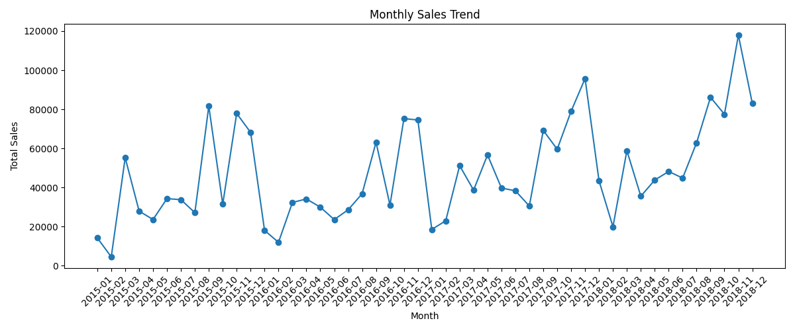
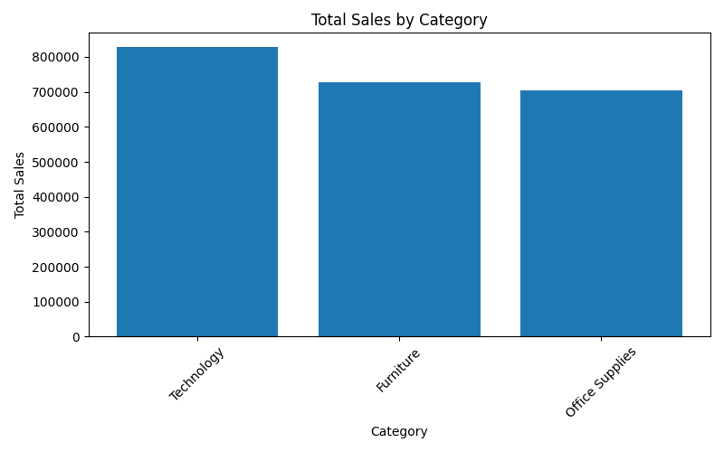
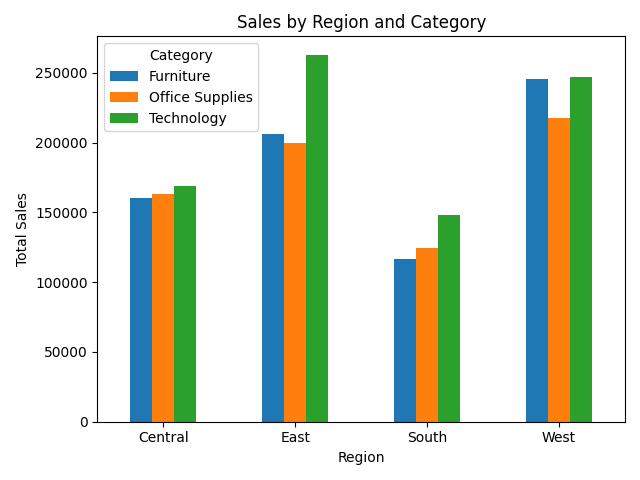
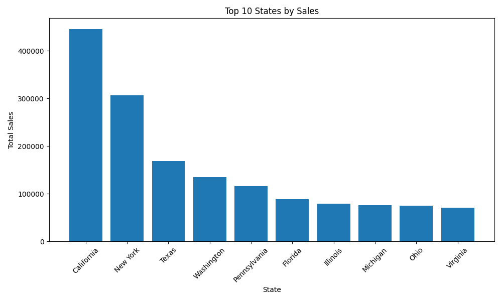
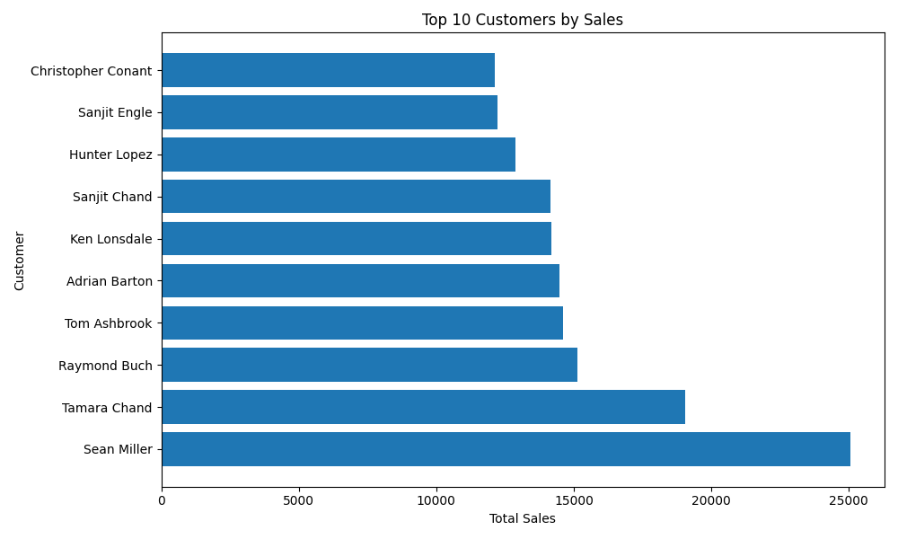

# Sales Data Analysis with Python

**Dataset Source:** Kaggle

## 📌 Project Overview

This project analyzes sales transaction data using Python, with a focus on data cleaning, exploratory data analysis (EDA), data aggregation, and visualization.

The goal of this project is to transform raw sales data into meaningful business insights and demonstrate an end-to-end data analysis workflow.

The project covers the following process:

> **Raw Data → Data Cleaning → Data Analysis → Visualization → Business Insights**

---

## 🎯 Project Objectives

The main objectives of this project are:

* Clean and preprocess raw sales data using Pandas
* Convert and standardize date-related data
* Handle duplicate records and inconsistent text formatting
* Analyze sales performance across different categories and regions
* Identify high-performing states and customers
* Analyze monthly sales trends
* Create clear and business-oriented visualizations
* Generate actionable business insights from the analysis

---

## 🛠️ Tools & Technologies

* **Python**
* **Pandas** — Data cleaning, transformation, aggregation, and analysis
* **NumPy** — Numerical operations
* **Matplotlib** — Data visualization
* **Jupyter Notebook / VS Code**
* **Git & GitHub** — Version control and project management

---

## 📂 Project Structure

```text
project2/
│
├── project2.py
├── project2_dataset.csv
├── README.md
├── requirements.txt
│
└── charts/
    ├── monthly_sales_trend.png
    ├── sales_by_category.png
    ├── sales_by_region_category.png
    ├── top10_states_by_sales.png
    └── top10_customers_by_sales.png
```

### File Description

| File / Folder          | Description                                                       |
| ---------------------- | ----------------------------------------------------------------- |
| `project2.py`          | Main Python script for data cleaning, analysis, and visualization |
| `project2_dataset.csv` | Raw sales dataset                                                 |
| `README.md`            | Project documentation and business insights                       |
| `requirements.txt`     | Python package dependencies                                       |
| `charts/`              | Generated visualization files                                     |

---

# 📊 Dataset

The dataset contains sales transaction records with information related to orders, customers, locations, products, categories, and sales.

The dataset contains approximately **9,800 records and 18 columns**.

Important variables include:

| Column          | Description                     |
| --------------- | ------------------------------- |
| `Row ID`        | Unique row identifier           |
| `Order ID`      | Order identifier                |
| `Order Date`    | Date when the order was placed  |
| `Ship Date`     | Date when the order was shipped |
| `Ship Mode`     | Shipping method                 |
| `Customer ID`   | Customer identifier             |
| `Customer Name` | Customer name                   |
| `Segment`       | Customer segment                |
| `Country`       | Country                         |
| `City`          | City                            |
| `State`         | State                           |
| `Postal Code`   | Postal code                     |
| `Region`        | Sales region                    |
| `Product ID`    | Product identifier              |
| `Category`      | Product category                |
| `Product Name`  | Product name                    |
| `Sales`         | Sales amount                    |

---

# 🧹 Data Cleaning

Before performing the analysis, the raw dataset was cleaned and prepared for further analysis.

### 1. Remove Duplicate Records

Duplicate rows were removed to reduce the risk of double-counting sales.

```python
df = df.drop_duplicates()
```

---

### 2. Convert Date Columns

The `Order Date` and `Ship Date` columns were converted from text to datetime format.

```python
df["Order Date"] = pd.to_datetime(
    df["Order Date"],
    format="%d/%m/%Y"
)

df["Ship Date"] = pd.to_datetime(
    df["Ship Date"],
    format="%d/%m/%Y"
)
```

This allows the project to perform time-based analysis such as:

* Yearly sales
* Monthly sales
* Sales trends over time

---

### 3. Clean Text Columns

Text fields were standardized by converting them to string type and removing unnecessary leading and trailing spaces.

```python
df[cols] = df[cols].apply(
    lambda x: x.astype("string").str.strip()
)
```

This helps prevent inconsistent values caused by unnecessary whitespace.

---

### 4. Create Time-Based Variables

Year and month were extracted from the order date.

```python
df["Year"] = df["Order Date"].dt.year
df["Month"] = df["Order Date"].dt.month
```

These variables were then used for monthly sales analysis.

---

# 🔍 Exploratory Data Analysis

The project uses Pandas `groupby()` and `pivot_table()` to analyze sales performance from multiple perspectives.

The main analysis dimensions include:

* Sales by Category
* Monthly Sales Trend
* Sales by Region and Category
* Top 10 States by Sales
* Top 10 Customers by Sales

---

# 📈 Data Visualization

Five main visualizations were selected for the final project.

## 1. Monthly Sales Trend

This visualization shows how total sales changed over time.



### Analysis

The monthly sales trend helps identify periods of relatively high and low sales.

Understanding these fluctuations can support:

* Demand planning
* Inventory planning
* Sales forecasting
* Marketing campaign planning

Rather than focusing only on total annual sales, analyzing monthly trends provides a more detailed view of sales performance over time.

---

## 2. Total Sales by Category

This chart compares total sales across the three major product categories.



### Analysis

Based on the analysis:

* **Technology** generated the highest total sales.
* **Furniture** ranked second.
* **Office Supplies** generated the lowest total sales.

The results indicate that Technology is an important revenue contributor within the dataset.

From a business perspective, high-performing categories may deserve additional attention in areas such as:

* Product portfolio management
* Inventory allocation
* Marketing investment
* Sales strategy

However, total sales alone do not necessarily indicate profitability, because the dataset does not provide complete cost or margin information.

---

## 3. Sales by Region and Category

This visualization compares category sales across different regions.



### Analysis

Technology generated the highest sales in all four regions, indicating that it is a consistently strong-performing product category across different geographic markets.

Although Technology ranks first in every region, the sales gap between Technology and the other categories varies by region. This suggests that while Technology has broad and consistent demand, the relative importance of other product categories may differ across markets.

Potential business applications include:

- Maintaining sufficient inventory and availability for Technology products across regions
- Identifying regions where the sales gap between Technology and other categories is smaller
- Developing region-specific strategies for lower-performing categories
- Allocating sales and marketing resources based on regional category performance


---

## 4. Top 10 States by Sales

This chart identifies the ten states with the highest total sales.



### Analysis

Sales are concentrated in a relatively small number of high-performing states.

These states represent important revenue markets and may deserve additional attention from the business.

Potential applications include:

* Regional sales planning
* Market development
* Customer acquisition
* Distribution planning
* Resource allocation

However, high sales concentration may also create potential geographic concentration risk if the business becomes overly dependent on a small number of markets.

---

## 5. Top 10 Customers by Sales

This chart identifies the customers who generated the highest total sales.



### Analysis

The analysis identifies a group of high-value customers who contribute significant sales.

These customers may be important for:

* Customer retention
* Relationship management
* Personalized marketing
* Cross-selling
* Upselling

The business could further analyze purchase frequency, average order value, and customer lifetime value to determine whether these customers are consistently valuable over time.

---

# 💡 Business Insights

Based on the analysis, several potential business insights can be identified.

### 1. Technology is an Important Revenue Driver

Technology generated the highest total sales among the three categories.

This suggests that Technology is an important contributor to overall revenue and may deserve continued attention in product planning, inventory management, and marketing strategy.

However, sales revenue should not be treated as equivalent to profitability. Additional cost and margin data would be required to evaluate the actual financial contribution of each category.

---

### 2. Sales Performance Changes Over Time

Monthly sales analysis shows that sales are not evenly distributed throughout the year.

Periods with relatively high sales may require sufficient inventory and operational capacity, while lower-sales periods may provide opportunities for targeted promotions or resource optimization.

Further analysis using multiple years of historical data could help identify recurring seasonal patterns.

---

### 3. Regional Category Mix Differs

Technology generated the highest sales in all four regions, indicating consistently strong performance across different geographic markets.

However, the sales gap between Technology and the second-highest category varies by region. This suggests that although Technology is consistently the leading category, the relative importance of other categories differs across geographic markets.

From a business perspective, companies could maintain strong Technology product availability across regions while developing region-specific strategies for other product categories based on their relative sales performance.

---

### 4. Sales Are Concentrated in Certain States

The Top 10 States analysis shows that a relatively small group of states contributes a significant amount of sales.

These markets may represent important business opportunities.

At the same time, concentration in a limited number of geographic markets could create potential risk if the company becomes too dependent on those markets.

---

### 5. High-Value Customers Are Important

The Top 10 Customers analysis identifies customers with particularly high total sales.

Maintaining strong relationships with these customers may be important because losing a high-value customer could have a larger impact on revenue than losing a low-value customer.

Further analysis could examine customer purchase frequency and long-term value to distinguish between one-time large purchases and consistently high-value customers.

---

# 📌 Key Findings

| Analysis      | Key Finding                                                                              |
| ------------- | -----------------------------------------------------------------------------------------|
| Category      | Technology has the highest total sales                                                   |
| Monthly Trend | Sales fluctuate across different months                                                  |
| Region        | Technology has the highest sales in all four regions, but the sales gap varies by region |
| State         | Sales are concentrated in several high-performing states                                 |
| Customer      | A small group of customers contributes significant sales                                 |

---

# 🚀 Future Improvements

This project currently focuses primarily on sales revenue and descriptive analysis.

Future improvements could include:

### 1. Profit Analysis

Add profit and cost data to evaluate profitability rather than only sales revenue.

### 2. Customer Segmentation

Analyze customers based on:

* Purchase frequency
* Total spending
* Average order value
* Recency

This could support customer segmentation and targeted marketing.

### 3. Sales Forecasting

Use historical monthly sales data to build a forecasting model for future demand.

Potential approaches include:

* Moving averages
* Linear regression
* Time-series models

### 4. Statistical Analysis

Statistical methods could be used to determine whether differences between categories or regions are statistically significant.

For example:

* T-test
* ANOVA
* Correlation analysis

### 5. Interactive Dashboard

The analysis could be further developed into an interactive dashboard using tools such as:

* Power BI
* Tableau
* Streamlit

This would allow users to dynamically filter sales performance by region, category, customer, and time period.

---

# 🧠 Skills Demonstrated

This project demonstrates practical experience with:

### Python

* Variables and data structures
* Functions
* Data processing
* File handling

### Pandas

- `read_csv()`
- `drop_duplicates()`
- `to_datetime()`
- `groupby()`
- `pivot_table()`
- `sort_values()`
- `reset_index()`
- Data filtering
- String cleaning
- Datetime processing

### NumPy

* Numerical operations
* Array-based calculations

### Matplotlib

* Line charts
* Bar charts
* Horizontal bar charts
* Chart labeling
* Figure sizing
* Axis rotation
* Saving figures with `savefig()`
* Layout optimization with `tight_layout()`

### Data Analysis

* Data cleaning
* Exploratory data analysis
* Aggregation
* Trend analysis
* Category comparison
* Regional analysis
* Customer analysis
* Business interpretation

---

# 🔄 Analysis Workflow

The overall workflow of this project can be summarized as:

```text
Raw CSV Data
      ↓
Data Inspection
      ↓
Data Cleaning
      ↓
Date Transformation
      ↓
Exploratory Data Analysis
      ↓
Data Aggregation
      ↓
Business-oriented Visualization
      ↓
Business Insights
```

---

# 🎯 Conclusion

This project demonstrates an end-to-end sales data analysis workflow using Python.

Instead of only creating visualizations, the project focuses on transforming raw transaction data into structured information and then interpreting the results from a business perspective.

The analysis identified several important patterns, including the strong contribution of Technology sales, differences in category performance across regions, geographic sales concentration, and the importance of high-value customers.

The project also provides a foundation for future work in profitability analysis, customer segmentation, forecasting, statistical testing, and interactive dashboards.

> **The goal of this project is not only to calculate the numbers, but also to understand what those numbers may mean for business decision-making.**
